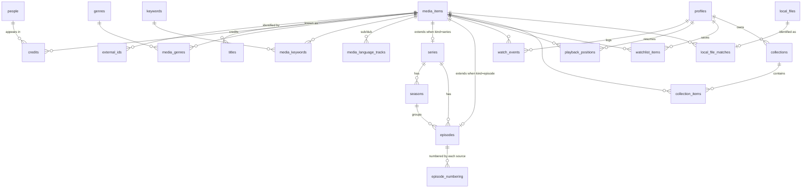

# Architecture

Module boundaries, data flow, and the entity-relationship diagram.

> **Status: Phase 3.** The shell and the data layer are built; the rest is
> specified in `SPEC.md` §6 but not yet written. This document fills in as each subsystem lands, and is updated whenever the
> shape of the system changes (`SPEC.md` §11.1).
>
> For the plain-English version, read [`HOW_IT_WORKS.md`](HOW_IT_WORKS.md) first.
> This file is the precise one.

## Filled in by

| Section | Phase |
|---|---|
| Process model and the IPC boundary | 1 |
| Entity-relationship diagram for the schema | 3 |
| Catalogue ingestion pipeline | 4 |
| Search: FTS5 + HNSW + fusion | 5 |
| The `SourceBackend` trait and the resolver | 6 |
| Torrent scheduler and the local HTTP server | 7 |
| Playback pipeline | 8 |
| Taste, recommendation and discovery | 15–17 |

## Load-bearing invariants

These hold from the phase that introduces them and must not be broken silently.

- **Business logic never lives in `src-tauri/src/commands/`.** That directory is the
  IPC surface: thin, no logic.
- **Raw SQL lives only in `crates/persistence/`.** `src-tauri/src/persistence/`
  contains re-exports and nothing else, and `tools/guard` fails the build if a
  `sqlx` call or a SQL literal appears anywhere under `src-tauri/`. This is not
  tidiness: `cargo test` cannot run inside the Tauri crate on Windows (ADR-0022),
  so anything placed there is permanently untestable.
- **All source access goes through the `SourceBackend` trait** (§6.1). A local file,
  a torrent, a debrid link and an HTTP stream are all `SourceCandidate`s, ranked by
  one scoring function. Changing this trait requires an ADR.
- **Tier gating goes through `tiers.rs` only.** No feature checks hardware directly.
- **One canonical `MediaItem`** (§6.2), generic over `media_kind`, so Phases 24–25
  need no migration.

---

## The schema `⬜ → ✅ Phase 3`

Four reversible migrations in `crates/persistence/migrations/`. The full rationale
for each table is in the migration files themselves, which are the authoritative
commentary; this is the shape.

`settings` and `sources_config` stand alone and are omitted from the diagram.

### The four decisions worth knowing

**One `media_items` table, `kind` as the discriminator** (ADR-0025). All eight kinds
exist from migration 0001, including `manga_chapter` and `comic_issue`, which
nothing uses until Phases 24–25. SQLite cannot alter a `CHECK` constraint — changing
one means rebuilding the table and every index — so including them now costs nothing
and adding them later costs a migration over a user's irreplaceable history.

**`series` and `episodes` are extension tables, not columns.** Putting
`absolute_number` and `total_episodes` on `media_items` would carry a dozen
always-`NULL` columns across every film row, and the Phase 3 lookup budget is
measured over exactly that table.

**`episode_numbering` stores what each source SAID.** A long-running anime has no
single correct episode number: TVDB says S03E07, AniList says 59, MAL restarts at 1
each cour. The conversions are not arithmetic — cours split unevenly and sources
disagree about whether recaps consume a number — so resolution is a lookup that
reports which scheme it matched on, never a calculation. Phase 12's exit criterion
is a false-confident rate below 1%, which is unreachable if the layer beneath it
guesses.

**`watch_events` is an append-only log, not a `watched` flag.** Phase 15 needs to
know that something was watched three times in 2019 and never since. A boolean
discards that permanently, and storage is trivial by comparison.

### Configuration that is load-bearing

- **WAL**, so a background library scan does not block the UI's reads. Paired with
  `synchronous = NORMAL`: fsync at checkpoints rather than every commit, which
  risks the last few transactions on power loss but never a corrupt database.
- **`foreign_keys = ON`, per connection.** SQLite ignores every `REFERENCES` clause
  without it, so the whole schema's referential integrity depends on one PRAGMA.
- **Migrations are embedded in the binary**, not loose `.sql` files beside the
  executable. A portable app is a folder the user can copy, and a half-copied folder
  must not produce a database the app cannot open.
- **`idx_titles_text` is `COLLATE NOCASE`** to match the query's comparison. SQLite
  silently full-scans when the collations differ: measured at 26.7 ms versus
  0.081 ms over 500,000 rows.

### Where the data lives

`data/` next to the executable by default (`SPEC.md` §2.4), `%APPDATA%` as an opt-in,
and a development mode that walks up to the workspace root — without which
`cargo run` writes the dev database into `target/`, where `cargo clean` destroys it.
`SINEPHILE_DATA_DIR` overrides all three.
