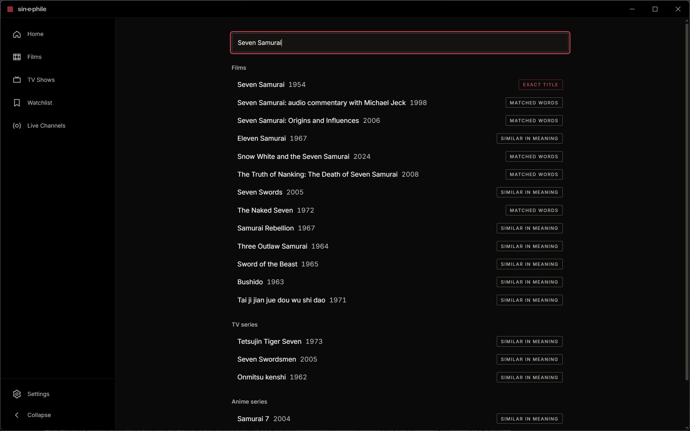
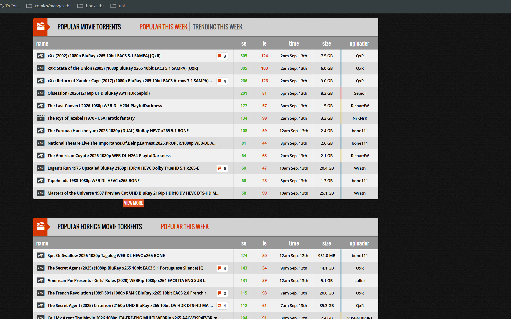
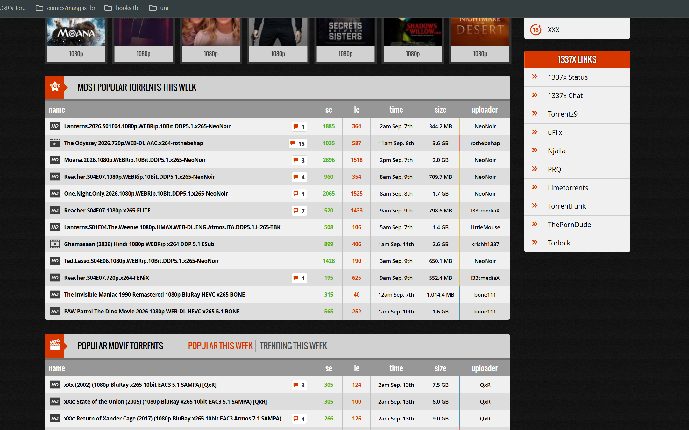

# Case study — search

**Phase 5.** Screenshots are of the release build on the real 2,702,737-title catalogue,
captured by `tools/shots/capture.ps1`, which launches the binary and types into it. They
are re-takeable: `powershell -ExecutionPolicy Bypass -File tools/shots/capture.ps1`.

---

## What the engine is

Three tiers, and the order is the guarantee.

1. **Exact title** — bypasses ranking entirely. Typing *Solaris* and not getting
   *Solaris* first is the failure a search engine is not allowed to have, and no amount
   of good ranking makes that *certain*. So it never enters the ranking at all.
2. **Fused** — BM25 and vector search combined by reciprocal rank, over positions rather
   than scores, because a BM25 score and a cosine distance are not comparable and
   pretending otherwise is a tuning problem with no stable answer.
3. **Fuzzy** — typo tolerance, only when the tiers above found almost nothing, because it
   costs a trigram scan over millions of rows.

Structured filters — year ranges, runtime bounds, "directed by" — are extracted before
any of that and applied as **constraints**, not fed to the embedder. Models are poor at
numbers; `release_year BETWEEN 1950 AND 1959` is not.

---

## It works, and here is what that looks like

**This one page shows every tier at once.** *Seven Samurai* (1954) is first and labelled
**exact title** — that is tier 1 refusing to let ranking have an opinion. Behind it, the
audio commentary and the *Origins and Influences* documentary arrive on **matched words**.
And then the interesting part: *Samurai Rebellion*, *Three Outlaw Samurai*, *Sword of the
Beast*, *Bushido* — classic samurai cinema that shares no title words with the query — on
**similar in meaning**. Under Anime series, *Samurai 7*: the 2004 anime adaptation of the
film that was typed.

Nothing in the ranking was told those films are related. The vector half put them there.

**"films directed by Alfred Hitchcock from the 1950s"** returns eleven films, every one
directed by Hitchcock, every one released between 1950 and 1959, most-voted first. The
query is parsed into a director and a decade, the residual text is discarded as
meaningless, and the result comes from an indexed join rather than from hoping an
embedding encoded a date.

Measured: nDCG@10 of **1.0000** on the filter half of the fixture.

---

## And here is what does not work

**This is the query exit criterion E4 names, and it is not answered.** The results are
thematically coherent — *Good Grief*, *Mourning Has Broken*, *Bereavement*, *No Sad Songs*
— and *Good Grief* (2023) genuinely is a comedy about bereavement, so the first result is
defensible. But most of the page is films with grief-adjacent **titles**, and the clause
"that aren't depressing" has no effect whatsoever. Negation is not represented.

**E4's second query, and a more interesting failure.** The engine clearly knows who Wong
Kar-wai is: *Chungking Express*, *Days of Being Wild*, *As Tears Go By* and *Hua yang de
nian hua* (*In the Mood for Love*) are his, and it found them from his name alone with no
credit lookup involved. Below them, the TV series section is entirely Korean drama.

So it understood **both halves of the query, separately, and composed neither.** It did
not find Korean films that resemble his; it found his films, and some Korean ones.

Measured: nDCG@10 of **0.1188** on the meaning half.

---

## Why, precisely

Not for want of trying, and the diagnosis is measured rather than assumed. Four distinct
attempts, each of which helped and none of which was enough:

| attempt | result |
|---|---|
| Load 233,114 Wikipedia synopses into a catalogue that had **zero** | helped, insufficient |
| Index only items that have descriptive text (855,703 → 119,874) | index 435 MB → 61 MB; helped, insufficient |
| Remove titles from the embedded document | helped, insufficient |
| Replace `all-MiniLM-L6-v2` with `bge-small-en-v1.5` | the Wong Kar-wai result above; insufficient |

The measurement that ended the sequence, before the model swap:

| item | cosine to a plot query describing it |
|---|---|
| *Manchester by the Sea* — its synopsis contains the query almost verbatim | **0.1944** |
| *Fish Hooky* — synopsis: "the 120th Our Gang short to be released" | **0.4194** |

Production trivia outscored a near-verbatim plot match by more than two to one. That is
**hubness**: short generic documents sit near the centre of an embedding space and are
therefore close to every query, and no amount of additional text fixes a document that
has none. `all-MiniLM-L6-v2` was also the wrong *kind* of model — trained for symmetric
similarity, asked to do asymmetric retrieval.

Swapping to a retrieval-trained model moved that pair from 0.1944/0.4194 to
**0.4947/0.4694** — the correct answer overtook the trivia — and produced the Wong Kar-wai
page above. It did not reach E3's bar.

---

## The numbers

| | | target |
|---|---|---|
| **E1** keystroke → results, hybrid, warm | p50 9.8 ms, **p95 31.3 ms** | < 80 ms |
| **E2** exact-title top-1 | **43/43 = 100%** | 100% |
| **E3** nDCG@10, filter half | **1.0000** | > 0.75 |
| **E3** nDCG@10, meaning half | **0.1188** | > 0.75 |
| HNSW recall@10 vs brute force | **0.9670** | ≥ 0.95 |
| Index | 61 MB on disk, **1.0 MB resident** | — |
| Cold start with the database open | **328–522 ms** | < 2,000 ms |

**E1 is measured and not claimed**: §2.3 enforces budgets against Tier 0 hardware and
these are Tier 2 numbers. **E3 and E4 are not met.**

---

## What was learned

**Measure the thing you are about to spend hours on, first.** `eval embed --compare`
priced a document-layout change in one command and showed it would lift the right answer
and the wrong answers equally — a three-hour re-embed that would have bought nothing.

**A fixture written from the code cannot fail.** Every expected film in
`fixtures/search/semantic-queries.tsv` was named from knowledge of cinema before anything
was run. Two earlier fixtures in this project were each wrong four times on their first
run, with the code right both times.

**Look at output, not only at metrics.** The artefact passed every check Phase 4 wrote —
checksum, determinism, model identity, and later recall@10 of 0.967 — while containing
documents that could not answer a question about a film. Those checks verify the file is
*correct*, not that it is *informative*. One query found it immediately.

**And a screenshot is a test.** Every result on the Hitchcock page was labelled "matched
words". They had not matched words; they came from a filter. The CLI never showed it,
because the CLI never rendered the badge.
